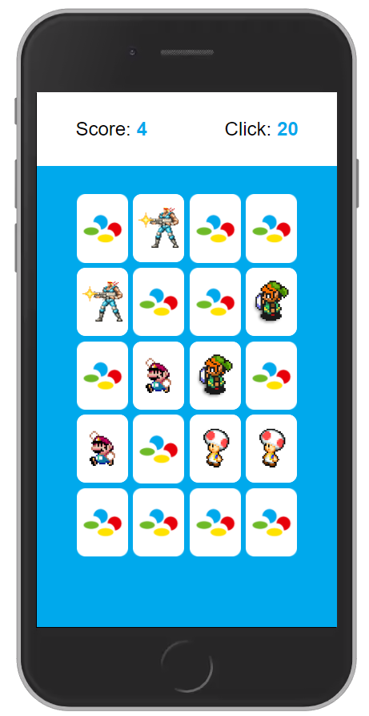

<h1 align="center">
    
</h1>

    
    
    
    

 

    

 

## Technologies

- HTML
- CSS
- JavaScript

## Project

This is a simple Memory Game with SNES characters.

## Run

Just open the `index.html`.

## License

This project is under the CC BY-SA 4.0. See [LICENSE](/LICENSE.md) file for more details.